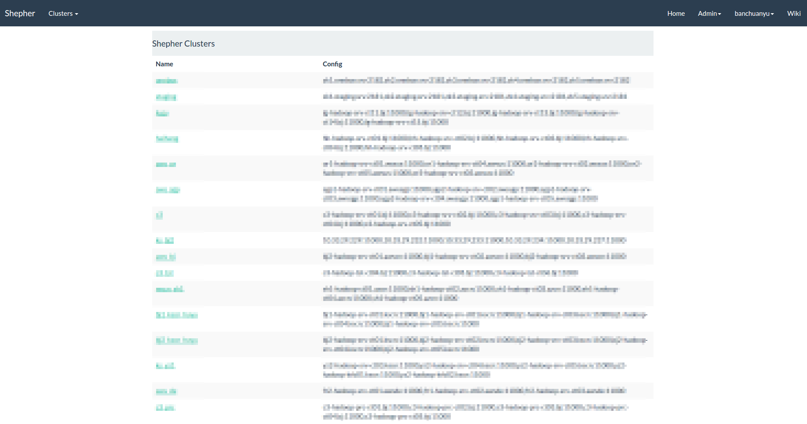
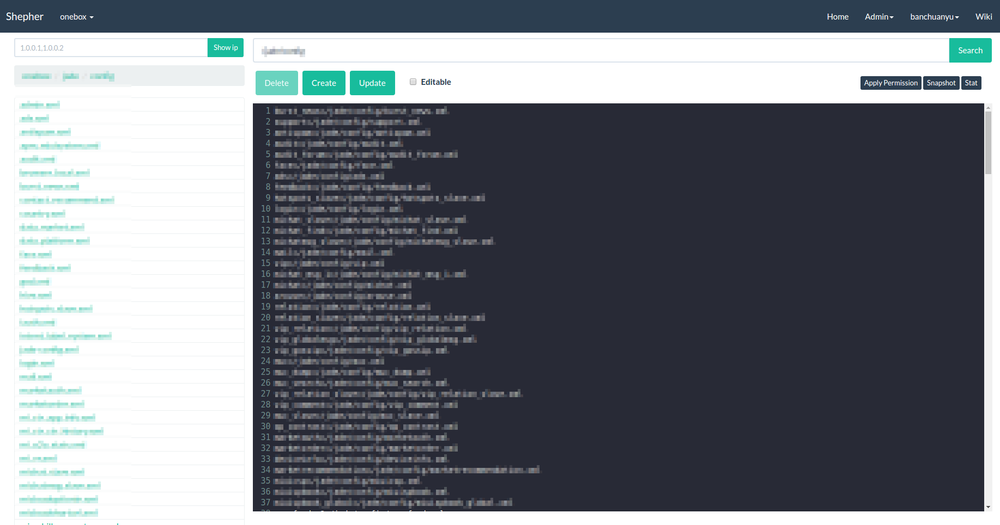

Shepher
======
Shepher 是一款 Zookeeper 的 web 管理工具。[Readme in English](README.md)

## 特性
- ZK 节点的 CRUD 操作
- ZK 节点的快照管理
- ZK 节点修改的 Diff 和 Review 功能
- ZK 节点操作邮件通知
- 集成 CAS 和 LDAP 登录
- 权限管理，参照 [权限管理说明](Docs/Authority-zh.md)

## 同类产品功能对比

产品 | 简介 | 节点的CURD 操作 | 快照管理 | 节点修改的 Diff 和 Review 功能 | 节点操作邮件通知 | CAS 和 LDAP 登录 | 权限管理 | 级联删除 | 系统状态监控
---|---|---|---|---|---|---|---|---|---
Shepher | ZK 管理 | √ | √ | √ | √ | √ | √ |   |  
TaoKeeper | ZK 集群监控与报表 |   |   |   |   |   |   |   | √
Zkdash | ZK 管理 | √ | √ |   |   |   |   | √ |  
Disconf | ZK 管理 | √ | √ |   | √ |   | √ | √ | √
XDiamond | 配置中心 | √ |   |   |   | √ | √ |   | √

## 系统截图
- 首页


- 节点编辑


## 安装

### 环境要求
- JDK 1.8
- Maven 3.2 +
- MySQL 5.6

### 配置和使用

#### 基本配置

- 修改 `db/init.sql` 中的 `INSERT INTO user VALUES (1,'youradmin',now());` ，将 `youradmin` 改为你的管理员用户名

#### 本地编译部署

1. 将 `db/init.sql` 导入到 MySQL
2. 参照 [application.properties 参数说明](#applicationproperties-参数说明) 修改 `shepher-web/src/main/resources/application-dev.properties` 的参数配置
3. 运行脚本

    ```sh
    $sh script/dev-build-start.sh
    ```
4. 在浏览器中访问 `http://localhost:8089` 或自定义的 `server.url` （参照 [application.properties 参数说明](#applicationproperties-参数说明)）

#### Docker 部署

使用 Docker 部署则自动集成 MySQL 和 Zookeeper，不需要再自行安装，一般用在开发测试环境。

1. 安装 Docker，以 Ubuntu 系统为例，安装 [docker engine](https://docs.docker.com/engine/installation/#installation) 和 [docker-compose](https://docs.docker.com/compose/install/)
2. 参照 [application.properties 参数说明](#applicationproperties-参数说明) 修改 `shepher-web/src/main/resources/application-docker.properties` 的参数配置
3. 运行脚本，并等待 Docker 中的各个容器启动完成

    ```sh
    $sh script/docker-build-start.sh
    ```
4. 在浏览器中访问 `http://localhost:8089` 或自定义的 `server.url` （参照 [application.properties 参数说明](#applicationproperties-参数说明)）

#### application.properties 参数说明

参数 | 含义 | 限定可选值 | 备注
---|---|---|---
mail.hostname | generalMailSender 使用的邮件服务器 |
mail.port | generalMailSender 使用的邮件服务器端口 |
mail.username | generalMailSender 用户名 |
mail.password | generalMailSender 认证码 |
mail.from | generalMailSender 发件人 |
mail.fromname | generalMailSender 发件人显示名 |
mail.sender | Shepher 系统使用的邮件发送方式 | generalMailSender/customMailSender | customMailSender 是自定义邮件类，参考CustomMailSender
cas.server.url.prefix | CAS 认证服务器地址 |
cas.login.url | CAS 认证服务器登录入口 |
cas.logout.url | CAS 认证服务器登出入口 |
ldap.url | LDAP 认证服务地址 |
ldap.password | LDAP 认证密码 |
ldap.dn | LDAP 认证 DN |
server.url | Shepher 服务地址 |
server.port | Shepher 服务端口 |
mail.mailToSuffix | 邮件接收人地址后缀 |
mail.mailAddressEndSeparator | 多邮件接收人分隔符 |
server.login.type | Shepher 登录类型 | CAS/LDAP | 目前仅支持 CAS 和 LDAP 两种登录方式
